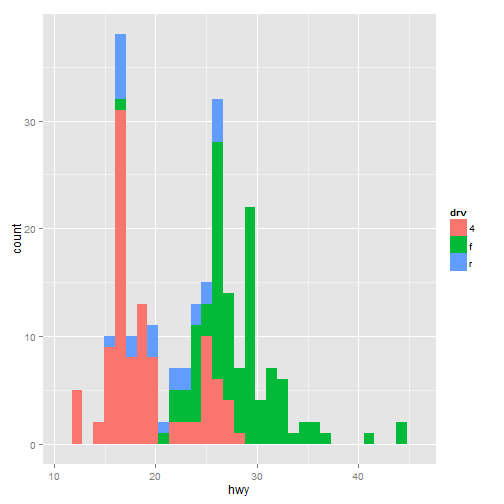

探索性数据分析 Exploratory Data Analysis
========================================

这个文档整理了[Coursera](https://www.coursera.org/)上数据系列课[Exploratory Data Analysis](https://www.coursera.org/course/exdata)的一些内容和笔记。

### 1. R中的绘图系统

R中有三大绘图系统，分别为 Base Plotting System，Lattice System 和 ggplot2 System。

#### Base Plotting System

Base Plotting System 是R自带的绘图系统。它的优点是使用非常方便，可以用一系列的R命令来绘图，
缺点是一旦生成图像之后就无法再改变，所以在绘图之前需要做一定的规划。

下面是一些例子


```r
library(datasets)
## 散点图
plot(cars$speed, cars$dist, xlab = "speed", ylab = "dist")
```

 

```r
## 直方图
hist(cars$speed, xlab = "speed")
```

 

```r
## 盒型图
boxplot(cars$speed, xlab = "speed")
```

 


#### Lattice System

Lattice System 是R中的一个包，项目的主页在[这里](http://lattice.r-forge.r-project.org)。
它的优点是用一个函数调用就可以生成图像，而且生成的图的大小能够自动调整适应，特别适合在一张图下绘制多个图的情况。
它的缺点则是仅用一次函数调用来生成图像有时候会显得太过复杂，而且在多图情况下给各个图添加注释也很不方便。
和Base Plotting System一样，Lattice System在图像生成后就无法再对图像做改变。

Lattice System中的一些绘图函数

- xyplot 用于生成散点图
- bwplot 用于生成盒型图
- histogram 用于生成直方图
- stripplot 和bwplot类似，用的是散点的形式
- dotplot 用于生成克利夫兰点图
- splom 用于生成散点图阵列
- levelplot, contourplot 利用图像来生成图

下面是`xyplot`的一些例子，使用形式 `xyplot(y ~ x | f * g, data, ...)`


```r
library(lattice)
library(datasets)
xyplot(Ozone ~ Wind, data = airquality)
```

 

```r
xyplot(Ozone ~ Wind | Month, data = airquality, layout = c(5, 1))
```

 


Lattice System中还可以使用Panel Function，针对每个子图添加额外的图形


```r
set.seed(10)
x <- rnorm(100)
f <- rep(0:1, each = 50)
y <- x + f - f * x + rnorm(100, sd = 0.5)
f <- factor(f, labels = c("Group 1", "Group 2"))
## 无panel function
xyplot(y ~ x | f, layout = c(2, 1))  ## 绘制两个子图
```

 

```r
## 自定义panel function
xyplot(y ~ x | f, panel = function(x, y, ...) {
    panel.xyplot(x, y, ...)  ## 先调用默认的panel function
    panel.abline(h = median(y), lty = 2)  ## 在中值处添加水平线
})
```

 

```r
## 自定义panel function
xyplot(y ~ x | f, panel = function(x, y, ...) {
    panel.xyplot(x, y, ...)  ## 先调用默认的panel function
    panel.lmline(x, y, col = 2)  ## 添加回归线
})
```

 


#### ggplot2 System

ggplot2 System 和 Lattice System 一样也是R中的其中的一个包，基于图形的语法，
试图结合 Base Plotting System 和 Lattice System 各自的优点，它的项目主页在[这里](http://ggplot2.org/)。
ggplot2 System 结合了 Base Plotting System 和 Lattice System 的特点，能够自动调节图像的大小来适应显示，
还能够很方便地给各个图添加注释，绘图函数的默认参数也给了绘图极大的方便，它还能够很轻松地实现复杂的多层图像。

qplot()的一些运用，qplot可以很方便地绘制出漂亮的图形


```r
library(ggplot2)  # 加载这个包
# 简单的散点图
qplot(displ, hwy, data = mpg)
```

 

```r
# 根据`drv`分类，用不同颜色显示的散点图
qplot(displ, hwy, data = mpg, color = drv)
```

 

```r
# 在散点图上额外添加图形
qplot(displ, hwy, data = mpg, geom = c("point", "smooth"))
```

 

```r
# 直方图
qplot(hwy, data = mpg, fill = drv)
```

 

```r
# 分类显示
qplot(displ, hwy, data = mpg, facets = . ~ drv)  # 横向显示
```

 

```r
qplot(hwy, data = mpg, facets = drv ~ .)  # 纵向显示
```

 


另外一些图形的绘制


```r
library(ggplot2)
library(datasets)
airquality$Month = factor(airquality$Month)
qplot(Ozone, data = airquality, fill = Month)
```

 

```r
qplot(Ozone, data = airquality, geom = "density", color = Month)
```

 

```r
qplot(Wind, Ozone, data = airquality, shape = Month)
```

 

```r
qplot(Wind, Ozone, data = airquality, color = Month, geom = c("point", "smooth"), 
    method = "lm")
```

 

```r
qplot(Wind, Ozone, data = airquality, geom = c("point", "smooth"), method = "lm", 
    facets = . ~ Month)
```

 


qplot()与R内置绘图系统的plot()很相似，但是提供了更多的特性，能够绘制出更漂亮的图形。

ggplot()能够更加灵活地绘制图形，它的绘制方式是一层一层地叠加图形特性，最后生成整个图像。
ggplot()函数返回一个对象，然后我们再在这个图像上不停地添加一些显示特性，最后可以通过print()函数来生成
最终的图形，对于编程来说，也很方便。


```r
library(ggplot2)
library(datasets)
g <- ggplot(airquality, aes(Wind, Ozone))
# 以散点图方式显示
g + geom_point()
```

 

```r
# 添加回归线
g + geom_point() + geom_smooth(method = "lm")
```

 

```r
# 分类显示
g + geom_point() + facet_grid(. ~ Month) + geom_smooth(method = "lm")
```

 

```r
# 更改标签
g + geom_point(aes(color = Month)) + labs(title = "Ozone ~ Wind", x = "Wind", 
    y = "Ozone")
```

 


### 2. 聚类分析

### 3. Demo
